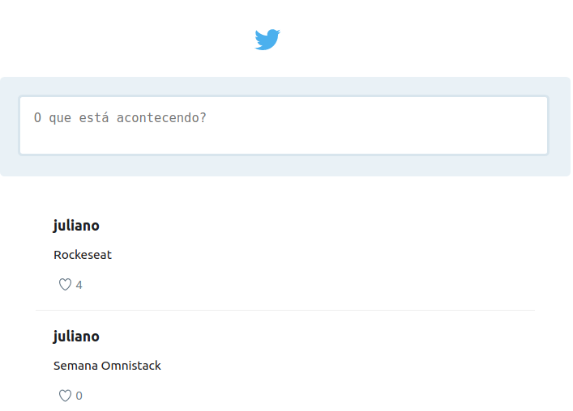

<h1 align="center">
    
</h1>

<h2 align="center">
   
💜 GoTwitter 🚀

</h2>

  

  

  

  <a href="#projeto">Projeto</a>&nbsp;&nbsp;&nbsp;|&nbsp;&nbsp;&nbsp;
  <a href="#protótipos">Protótipos</a>&nbsp;&nbsp;&nbsp;|&nbsp;&nbsp;&nbsp;
  <a href="#tecnologias">Tecnologias</a>&nbsp;&nbsp;&nbsp;
  

## Projeto:

O projeto foi desenvolvido durante a Semana Omnistack 05 ministrada pela Rocketseat. Consiste em uma aplicação na qual simula tweets em tempo real.

    
    

## Tecnologias
- REACT
- REACT NATIVE
- NODEJS
